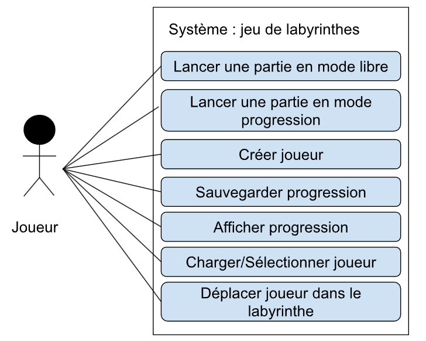

## *Equipe et organisation du travail* 

Le rapport ci-après décrira le travail réalisé par le **_Groupe J1_** lors de la réalisation de la SAE 3.02.
Celui-ci est composé des membres suivants :  

- Eva CHEN : Prototype d'interface Figma, Cas d'utilisation, Prototype de diagramme de classes (V1)
- Maxence MANGIN : Cas d'utilisation, Fiches techniques, Diagramme de classes (V2)
- Antoine USAL : Cas d'utilisation, Diagramme de classes (V1/V2)
- Loïse VIGNERON : Cas d'utilisation, Fiches techniques, Diagramme de classes (V1/V2)

## *Cas d'utilisation* 

Dans le but de mener à bien cette SAE, nous avons dans un premier temps établi un diagramme de cas d'utilisation.  

{ width=400px }

\noindent\vspace{3em}

Suite à ce *diagramme de cas d'utilisation*, nous pouvons décrire, dans un second temps, les *fiches techniques* suivantes :  

___
**Système :** Jeu de labyrinthe  
**Cas d'utilisation :** Charger un profil  
  
**Acteur principal :** Joueur  
**Déclencheur :** /  
**Autres acteurs :** /  
  
**Préconditions :** Le joueur a déjà créé un profil auparavant.  
**Garanties en cas de succès :** Chargement du profil du joueur.  
**Garanties minimales :** Le système ne change pas d'état.  
  
**Scénario nominal :**  

1. Le joueur sélectionne "Charger une partie".  
2. Le système affiche un champ de renseignement.  
3. Le joueur s'identifie en renseignant son pseudonyme dans le champ et valide.  
4. Le système charge son profil et lui propose le "Mode Progression".  
  
**Scénario alternatif :**  
(A) Le profil n'est pas retrouvé.  

4. (A) Le système affiche une erreur et propose au joueur de se créer un nouveau profil.  

\noindent\vspace{1em}

__*Prototypes d'interface*__  

\begin{figure}[H]
\centering
\includegraphics[width=0.6\textwidth]{./img/CU11.png}
\caption{Ecran d'accueil}
\end{figure} 

\noindent\vspace{5em}

\begin{figure}[H]
\centering
\includegraphics[width=0.6\textwidth]{./img/CU12.png}
\caption{Ecran de récupération de profil}
\end{figure}  

\noindent\vspace{10em}

\begin{figure}[H]
\centering
\includegraphics[width=0.6\textwidth]{./img/CU13.png}
\caption{Ecran de profil chargé}
\end{figure}

\noindent\vspace{20em}

Cas où le profil n'est pas retrouvé :  

\begin{figure}[H]
\centering
\includegraphics[width=0.6\textwidth]{./img/CU14.png}
\caption{Ecran d'invitation à la création d'un profil}
\end{figure}

___
**Système :** Jeu de labyrinthe  
**Cas d'utilisation :** Afficher la progression

**Acteur principal :** Joueur  
**Déclencheur :** /  
**Autres acteurs :** /

**Préconditions :** Le joueur a créé ou chargé un profil.  
**Garanties en cas de succès :** La progression du joueur est affichée.  
**Garanties minimales :** Le système ne change pas d'état.

**Scénario nominal :**  

1. Le joueur sélectionne "Mode Progression".  
2. Le système affiche les différentes étapes validées et non validées.  
3. Le joueur clique sur une étape pour voir les défis.  
4. Le système affiche les défis de l'étape choisie.  

\noindent\vspace{20em}

__*Prototypes d'interface :*__  

\begin{figure}[H]
\centering
\includegraphics[width=0.6\textwidth]{./img/CU21.png}
\caption{Ecran du profil chargé}
\end{figure}

\noindent\vspace{10em}

\begin{figure}[H]
\centering
\includegraphics[width=0.6\textwidth]{./img/CU22.png}
\caption{Ecran des étapes}
\end{figure} 

\begin{figure}[H]
\centering
\includegraphics[width=0.6\textwidth]{./img/CU23b.png}
\caption{Ecran des défis}
\end{figure}

___
**Système :** Jeu de labyrinthe  
**Cas d'utilisation :** Lancer une partie en "Mode Progression"

**Acteur principal :** Joueur  
**Déclencheur :** /  
**Autres acteurs :** /

**Préconditions :** Le joueur a déjà créé un profil auparavant.  
**Garanties en cas de succès :** Une partie en "Mode Progression" est lancée.  
**Garanties minimales :** Le système ne change pas d'état.

**Scénario nominal :**  

1. Le joueur sélectionne "Mode Progression".  
2. Le système affiche les différentes étapes.  
3. Le joueur choisit soit une ancienne étape, soit la prochaine étape à valider.  
4. Le système affiche les 3 niveaux de l'étape.  
5. Le joueur choisit un des 3 niveaux.   
6. Le système lance la partie.  

**Scénario alternatif :**  
(A) Le mode progression ne charge pas.  
2. (A) Le système affiche un message d'erreur et renvoie le joueur sur le menu d'accueil.    

\noindent\vspace{10em}

__*Prototypes d'interface :*__  

\begin{figure}[H]
\centering
\includegraphics[width=0.6\textwidth]{./img/CU21.png}
\caption{Ecran du profil chargé}
\end{figure} 

\noindent\vspace{10em}

\begin{figure}[H]
\centering
\includegraphics[width=0.6\textwidth]{./img/CU22.png}
\caption{Ecran des étapes}
\end{figure}

\begin{figure}[H]
\centering
\includegraphics[width=0.6\textwidth]{./img/CU23.png}
\caption{Ecran des défis}
\end{figure} 

\noindent\vspace{10em}

\begin{figure}[H]
\centering
\includegraphics[width=0.6\textwidth]{./img/CU24.png}
\caption{Ecran de la partie}
\end{figure}

\noindent\vspace{20em}

Cas où le mode progression ne charge pas :  

\begin{figure}[H]
\centering
\includegraphics[width=0.6\textwidth]{./img/CU25.png}
\caption{Ecran des étapes}
\end{figure}

\begin{figure}[H]
\centering
\includegraphics[width=0.6\textwidth]{./img/CU26.png}
\caption{Ecran d'accueil}
\end{figure}

___
**Système :** Jeu de labyrinthe  
**Cas d'utilisation :** Déplacer le joueur dans le labyrinthe

**Acteur principal :** Joueur  
**Déclencheur :** /  
**Autres acteurs :** /

**Préconditions :** Le joueur a lancé une partie (peu importe si c'est en "Mode Libre" ou "Mode Progression").  
**Garanties en cas de succès :** Le joueur peut se déplacer dans la direction voulue.  
**Garanties minimales :** Le système ne change pas d'état.

**Scénario nominal :**
1. Le joueur sélectionne une direction (Haut/Bas/Droite/Gauche).
2. Le système affiche la nouvelle position en déplaçant le 'pion' du joueur dans la direction voulue.
  
**Scénario alternatif :**  
(A) Le pion ne se déplace pas dans la bonne direction.  
(B) Le pion ne peut pas se déplacer dans la direction (obstacle : mur)  
2. (B) Le système informe le joueur qu'il ne peut pas aller dans cette direction.

\noindent\vspace{1em}

__*Prototypes d'interface :*__  

\begin{figure}[H]
\centering
\includegraphics[width=0.6\textwidth]{./img/CU31.png}
\caption{Ecran de la partie (avant déplacement du pion)}
\end{figure}

\noindent\vspace{10em}

\begin{figure}[H]
\centering
\includegraphics[width=0.6\textwidth]{./img/CU32.png}
\caption{Ecran de la partie (après déplacement du pion)}
\end{figure}

\noindent\vspace{15em}

Cas où le pion ne peut pas aller dans la direction :  

\begin{figure}[H]
\centering
\includegraphics[width=0.6\textwidth]{./img/CU33.png}
\caption{Message d'erreur pour le déplacement du pion}
\end{figure}

## *Diagramme de classes* 

Enfin, grâce au *diagramme d'utilisation* et aux *fiches techniques*, un *diagramme de classes* a pu être établi afin qu'il puisse répondre aux besoins demandés lors du **Jalon 1** de cette SAE. 

"){ width=600px }  

L'équipe a élaboré une première version du diagramme de classes. 
Néanmoins, suite aux échanges avec notre professeure, nous nous sommes rendus compte que ce diagramme contenait beaucoup de défauts et d'incohérences.  
Par exemple, la classe *Joueur* apparait de manière redondante à plusieurs endroits du diagramme, sans que cela soit justifié. Cette redondance complexifie inutilement les relations entre les classes.   
De plus, la classe *Jeu* est jugée superflue, puisqu'elle centralise des informations qui sont déjà présentes dans la classe *Partie*. Elle nuit donc à la clarté du diagramme. 
Les classes *Labyrinthe* et *Progression* étaient quant à elles trop simplifiées, ce qui ne permettait pas de gérer correctement la logique concernant la difficulté, les déplacements, l'acheminement des étapes de la progression du joueur, etc.  

Suite à ces constats et aux retours de notre professeure, nous avons décidé de revoir entièrement notre diagramme, afin d'obtenir une structure plus claire et plus cohérente.  

\begin{figure}[H]
\centering
\includegraphics[width=1\textwidth]{./img/DiagClassV2.png}
\caption{Diagramme de classes V2}
\end{figure}  
  
Pour cette seconde version du diagramme de classes, nous avons repensé sa structure pour la rendre plus claire et plus adaptée aux besoins du jeu.  
Les modifications principales concernent la gestion des modes de jeu, le labyrinthe en lui-même et la progression du joueur.   
Les choix de l'équipe pour cette deuxième version du digramme sont les suivants :  

* Suppression des redondances (*Jeu* et *Joueur*) pour simplifier le modèle.  
* Création d'une classe abstraite *Partie* avec deux sous-classes (*PartieLibre* et *PartieProgression*), permettant de mutualiser les comportements communs tout en distinguant les deux modes de jeu.  
* Enrichissement de la classe *Labyrinthe* avec les coordonnées des entrée et sortie et une collection de *Case* pour représenter le labyrinthe (facilitant la gestion des déplacements et de la représentation des murs).  
* Remaniement de la classe *Progression*, regroupant maintenant plusieurs *Etape*, qui chacunes sont composées de trois *Defi* (facile, normal, difficile), respectant ainsi la logique du mode progression.  
* La classe *Defi* contient les informations qui seront nécessaires (taille, difficulté) pour la génération d'un labyrinthe conforme aux paramètres attendus.  

Cette seconde version du diagramme présente donc une meilleure structure, qui est plus lisible et plus proche du fonctionnement attendu du jeu. Elle constitue une meilleure base pour le développement futur du jeu.  

  

