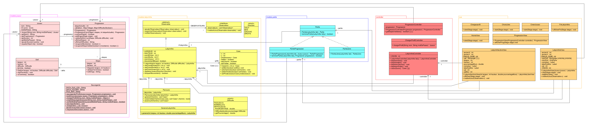
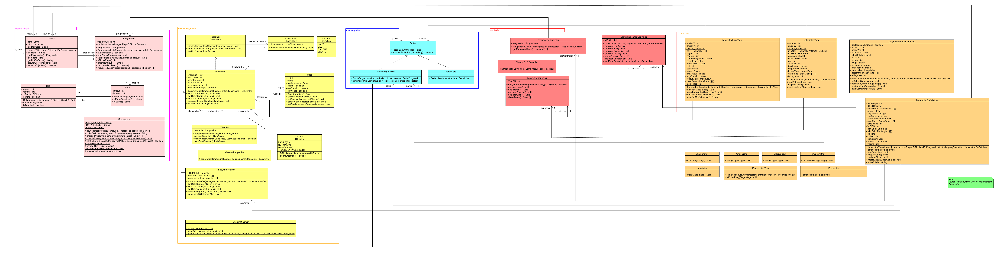

# UML

## Présentation de l'UML

### Détails de l'UML Jalon 1 :

---

#### 1. **Joueur**
- **getNom(): String** : Retourne le nom du joueur, utilisé pour l’identification ou l’affichage dans l’interface.
- **setNom(String nom): void** : Définit ou met à jour le nom du joueur, permettant une personnalisation initiale ou une modification.
- **getMotDePasse(): String** : Retourne le mot de passe, essentiel pour l’authentification lors de la connexion.
- **setMotDePasse(String motDePasse): void** : Définit ou change le mot de passe, gérant la sécurité de l’accès.
- **equals(Object obj): boolean** : Compare deux instances de Joueur (probablement sur nom/mot de passe) pour vérifier l’égalité, utile pour éviter les doublons.

---

#### 2. **Progression**
- **Progression(): Progression** : Initialise une nouvelle instance de progression, créant un état vide pour suivre les étapes.
- **validerEtape(): boolean** : Vérifie si l’étape courante est complétée (e.g., conditions remplies), retournant vrai pour autoriser l’avancement.
- **accepterEtape(): void** : Valide et passe à l’étape suivante si les conditions sont remplies, mettant à jour l’état.
- **notifierObservateur(): void** : Envoie une notification à tous les observateurs enregistrés (e.g., Partie, Labyrinthe) d’un changement d’état.
- **validerDifficulte(String difficulte): boolean** : Contrôle si la difficulté choisie est compatible avec la progression actuelle, évitant des niveaux inadaptés.
- **recupperEtapeValider(boolean valide): void** : Récupère et traite une étape validée (probablement "récupérerEtapeValider"), mettant à jour l’état interne en fonction du paramètre.

---

#### 3. **Observable** (interface/abstraite)
- **mettreAJourObservateur(Observable observateur): void** : Met à jour un observateur spécifique avec les données de l’observable, permettant une synchronisation ciblée.
- **notifierObservateur(): void** : Envoie une notification à tous les observateurs enregistrés, diffusant les changements globalement.

---

#### 4. **Observateur** (interface)
- **mettreAJourObservateur(Observable observateur): void** : Reçoit et traite une mise à jour d’un observable, permettant aux classes comme Partie de réagir aux événements.

---

#### 5. **Labyrinthe**
- **getHauteur(): int** : Retourne la hauteur de la grille, utilisée pour les calculs ou l’affichage.
- **getLargeur(): int** : Retourne la largeur de la grille, complétant les informations structurelles.
- **deplaceGauche(): void** : Déplace le joueur vers la gauche.
- **deplaceDroite(): void** : Déplace vers la droite.
- **deplaceHaut(): void** : Déplace vers le haut.
- **deplaceBas(): void** : Déplace vers le bas.
- **blaguerFovement(): boolean** *(probablement "bloquerMouvement")* : Vérifie si un mouvement est bloqué (e.g., mur), retournant un statut pour éviter les collisions.
- **genererLabyrinthe(): void** : Crée ou initialise la grille du labyrinthe (via un algorithme comme DFS), préparant le terrain.
- **labyrinthe(): Labyrinthe** *(constructeur ou getter)* : Initialise ou retourne l’instance du labyrinthe, assurant sa création.

---

#### 6. **Case**
- **getX(): int** : Retourne la coordonnée X de la case, pour sa localisation.
- **getY(): int** : Retourne la coordonnée Y, complétant la position.
- **setCoordEntree(int x, int y): void** : Définit les coordonnées d’entrée d’une case, initialisant le point de départ.
- **moveEntree(): boolean** : Déplace ou valide un mouvement vers l’entrée, retournant un statut de succès.
- **setPredecesseurCase(Case predecesseur): void** : Définit la case précédente, pour reconstruire un chemin (e.g., BFS).
- **getPredecesseurCase(): Case** : Retourne la case précédente, utile pour tracer le parcours.
- **setSelfEntree(): void** : Définit la case actuelle comme entrée, pour des cas spéciaux ou réinitialisation.

---

#### 7. **Partie**
- **Partie(): Partie** : Initialise une nouvelle instance de partie, créant un contexte de jeu vide.
- **chargerProfil(): void** : Charge les données du joueur (e.g., depuis une sauvegarde), préparant la session.
- **terminerPartieLabyrinthe(Joueur joueur): boolean** : Finalise la partie associée au labyrinthe, retournant un statut (victoire/échec).

---

#### 8. **PartieLabyrinthe**
- **PartieLabyrinthe(Joueur joueur): Partie** : Initialise une partie spécifique au labyrinthe avec un joueur.
- **terminerPartieLabyrinthe(): boolean** : Termine la session labyrinthe, retournant un statut de fin.
- **semerPartieLabyrinthe(): boolean** *(probablement "sauvegarderPartieLabyrinthe")* : Sauvegarde l’état de la partie labyrinthe, retournant un statut de succès.

---

#### 9. **PartieProgression**
- **PartieProgression(Joueur joueur): Partie** : Initialise une partie axée sur la progression avec un joueur.
- **terminerPartieProgression(): boolean** : Termine la progression globale, retournant un statut de fin.

---

#### 10. **ProgressionController**
- **ProgressionController(Progression progression): ProgressionController** : Initialise le contrôleur avec une progression, liant modèle et contrôle.
- **chargeProfilController(Progression progression): void** : Charge les données de progression dans le contrôleur, synchronisant l’état.
- **startStage(): void** : Lance une nouvelle étape de progression, déclenchant le début d’une phase.
- **nextStage(): void** : Passe à l’étape suivante, avançant le jeu.
- **affcherStage(): void** *(probablement "afficherStage")* : Affiche l’étape courante via la vue, synchronisant l’interface.

---

#### 11. **LabyrintheController**
- **LabyrintheController(Labyrinthe labyrinthe): LabyrintheController** : Initialise le contrôleur avec un labyrinthe, liant modèle et contrôle.
- **chargeProfilController(Labyrinthe labyrinthe): void** : Charge les données du labyrinthe dans le contrôleur, préparant l’environnement.
- **deplaceGauche(): void** : Délègue le déplacement gauche.
- **deplaceDroite(): void** : Délègue le déplacement droite.
- **deplaceHaut(): void** : Délègue le déplacement haut.
- **deplaceBas(): void** : Délègue le déplacement bas.
- **afficherStage(): void** : Affiche l’état du labyrinthe via la vue, synchronisant l’interface.
- **startStage(): void** : Lance l’étape labyrinthe, débutant une phase spécifique.

---

#### 12. **LabyrintheView**
- **LabyrintheView(): LabyrintheView** : Initialise l’instance de la vue, préparant l’affichage.
- **afficherStage(): void** : Affiche l’étape courante du labyrinthe à l’écran.
- **startStage(): void** : Démarre l’affichage d’une nouvelle étape, synchronisé avec le contrôleur.
- **nextStage(): void** : Met à jour l’affichage pour l’étape suivante, assurant la continuité.
- **afficherChem(ViewJoueur viewJoueur): void** : Affiche le chemin parcouru par le joueur, utilisant une vue spécifique.
- **visionZoom(Color color): void** : Applique un zoom ou une vue spéciale avec une couleur, améliorant l’expérience visuelle.
- **disparaitreColor(): void** : Fait disparaître une couleur (effet visuel), ajustant l’affichage dynamiquement.

---

#### 13. **LabyrintheLibreView**
- **LabyrintheLibreView(): LabyrintheView** : Initialise l’instance de la vue, préparant l’affichage.
- **afficherStage(): void** : Affiche l’étape courante du labyrinthe à l’écran.
- **startStage(): void** : Démarre l’affichage d’une nouvelle étape, synchronisé avec le contrôleur.
- **nextStage(): void** : Met à jour l’affichage pour l’étape suivante, assurant la continuité.
- **afficherChem(ViewJoueur viewJoueur): void** : Affiche le chemin parcouru par le joueur, utilisant une vue spécifique.
- **visionZoom(Color color): void** : Applique un zoom ou une vue spéciale avec une couleur, améliorant l’expérience visuelle.
- **disparaitreColor(): void** : Fait disparaître une couleur (effet visuel), ajustant l’affichage dynamiquement.

---

#### 14. **HomeView**
- **HomeView(): HomeView** : Initialise l’interface d’accueil, préparant l’écran principal.

---

#### 15. **ProgressionView**
- **ProgressionView(): ProgressionView** : Initialise l’affichage dédié à la progression.

---

#### 16. **ChargementController**
- **ChargementController(): ChargementController** : Initialise le contrôleur de chargement.
- **startStage(): void** : Lance le processus de chargement (e.g., fichiers ou données).

---

#### 17. **CreateJoueur**
- **CreateJoueur(): CreateJoueur** : Initialise l’outil de création de joueur.
- **affcherFinStage(): void** *(probablement "afficherFinStage")* : Affiche la fin de l’étape de création (e.g., confirmation).

---

#### 18. **Sauvegarde**
- **savegarderProfilJoueur(Progression progression): void** : Sauvegarde le profil du joueur avec sa progression.
- **chargerProfilJoueur(): Progression** : Charge et retourne la progression sauvegardée, rétablissant l’état.
- **crypterDonnee(String donnee, String nomFichier): void** : Crypte des données dans un fichier, sécurisant les sauvegardes.
- **decrypterDonnee(String nomFichier): String** : Décrypte et retourne les données d’un fichier, permettant la récupération.
- **mapJoueur(List<Joueur> joueurs): void** : Mappe ou stocke une liste de joueurs, gérant plusieurs profils.
- **savegarderPortfolioJoueurProgression(Progression progression): void** : Sauvegarde un portfolio étendu avec progression, offrant une sauvegarde détaillée.

---

#### 19. **Parcours**
- **Parcours(Labyrinthe labyrinthe): Parcours** : Initialise une instance pour gérer les chemins avec un labyrinthe.
- **genererChem(List<Case> listChem): boolean** : Génère un chemin à partir d’une liste de cases, retournant un statut de succès.
- **getChem(): List<Case>** : Retourne la liste du chemin généré, utile pour l’affichage ou la résolution.
- **getLastChem(): Case** : Retourne la dernière case du chemin, aidant à suivre la progression.
- **hasChem(): boolean** : Vérifie si un chemin existe, servant à valider la génération.

---

#### 20. **Difficulte**
- **getPourcentage(): double** : Retourne le pourcentage de complexité (e.g., densité de murs), influençant la difficulté.
- **Difficulte(int hauteur, int largeur, double pourcentage): Difficulte** : Initialise une difficulté avec dimensions et pourcentage, définissant le niveau.

### Détails de l'UML Jalon 2 

#### 1. **CheminMinimum**
- **getVoisinsInternesValides(Case c, Labyrinthe laby, Set<Case> chemin) List<Case>** : Retourne la liste des cases voisines internes qui ne sont ni des murs ni déjà dans le chemin principal, permettant d’étendre le chemin sans collision
- **connecterAuBord(Case depart, Case arrivee, Labyrinthe laby, Set<Case> chemin) void** : Crée un chemin direct entre la dernière case du chemin principal et la case de sortie choisie sur le bord.
- **sontAdjacents(Case a, Case b) boolean** : Retourne vrai si les deux cases sont directement adjacentes horizontalement ou verticalement.
- **genererAvecCheminMinimum(int largeur, int hauteur, int longueurCheminMin, Difficulte difficulte) Labyrinthe** : Génère un labyrinthe avec un chemin solution garanti d’au moins longueurCheminMin cases.

---

#### 2. **LabyrintheParfait**
- **enleverMur(int x1, int x2, int y1, int y2)** : Permet de retirer un mur entre 2 cases (selon leurs coordonnées respectives).
- **construireGrilleDepuisMurs()** : Permet de construire une grille du labyrinthe parfait servant à la vue.

--- 

#### 3. **LabyrintheParfaitView**
- **afficher(Stage stage)** : Initialisation de l'instance de la vue.
- **vueRestrainte()** : Permet de créer la vue restreinte pour les dernières étapes.
- **majMiniCarte()** : Permet de mettre à jour la carte du labyrinthe au fur et à mesure que le joueur se déplace.
- **majVueGlobal()** : Crée une vue autour du joueur, et l'affiche.

---

#### 3. **LabyrintheParfaitLibreView**
- **LabyrintheParfaitView(Joueur joueur, int numEtape, Difficulte diff, ProgressionController progController)** : Initialise la vue d'un labyrinthe parfait.
- **afficher(Stage stage)** : Crée et affiche l'interface du labyrinthe parfait.
- **vueRestrainte()** : Applique une vision limitée autour du joueur (étape 5).
- **majMiniCarte()** :  Met à jour une carte 8x8 avec les couleurs de la vision du joueur (étape 6).
- **majVueGlobal()** : Rend visible une zone autour du joueur et assombrit le reste (étape 6).
- **mettreAJour(Observable o)** : Méthoe de l'interface Observateur, met à jour le jeu.
- **texteCptMur(int cptMur)** : Retourne un message humoristique selon le nombre de fois où le joueur à foncé dans un mur.

---

#### 4. **Parametre**

- **afficher(Stage stage)** : Affiche l'écran des paramètres

---

#### 5. **LabyrintheParfaitController**
- **deplaceGauche()** : Délègue le déplacement gauche.
- **deplaceDroite()** : Délègue le déplacement droite.
- **deplaceHaut()** : Délègue le déplacement haut.
- **deplaceBas()** : Délègue le déplacement bas.
- **creerMiniGrille()** : Permet de créer la mini carte du labyrinthe.
- **visionZoom()** : Gère la vision du joueur dans le labyrinthe. 
- **deplacer(Direction dir)** : Déplace le pion du joueur dans le labyrinthe. 
- **murEntreCases()** : Renvoie un boolean indiquant s'il existe un mur entre deux cases (selon leur coordonnées respectives).

---

#### 6. **Modification des _Model_ du Jalon 1** 
* _Parcours_ : amélioration du code pour le rendre plus efficace.

---

#### 7. **Modification des _View_ du Jalon 1**
* Ajout d'images pour l'affichage des labyrinthe
* Adaptation de la taille du labyrinthe par rapport à l'écran

---
## Choix de l'UML

* `modele.joueur` :  
  Le package `modele.joueur` regroupe tout ce qui concerne l'état et la progression du Joueur.
  Nous avons choisi de les isoler afin de rendre la gestion des profils joueurs indépendante du reste du code, ce qui facilite ainsi les sauvegardes et les reprise/rechargement de parties(mode progression).

* `modele.labyrinthe` :  
  Ce package contient la logigue de notre jeu de labyrinthe.
  Il permet la génération et la réprésentation du labyrinthe sans impacter directement les joueurs.

* `modele.partie` :  
  Le package `modele.partie` nous permet de faire le lien entre le joueur et le labyrinthe via la classe `Partie`.
  En effet, il sert d'intermédiaire pour gérer une session de partie complète sans mélanger les responsabilités des autres modèle (`modele.joueur` et `modele.labyrinthe`) vue précédemment.

* `controller` :  
  `controller` permet de centraliser les contrôleurs qui ont pour but de faire le lien des interactions entre les modèles et les vues.
  Cette séparation via les contrôleurs évite que la vue accède et/ou modifie directement les données des autres classes des modèles.

* `vue` :  
  Concernant `vue`, ce package permet simplement de regrouper toutes les vues servant à l'affichage utilisateur de notre jeu.
  Grâce aux controlleurs, il reste indépendant des modèles, ce qui permet de remplacer l'interface graphique à tout moment, sans modifier le coeur et la logique du jeu.
  Les vues sont donc à long terme évolutives/modulaires.

L'équipe a choisi cette organisation pour :

- éviter au mieux les dépendances entre les classes
- permettre une répartition des tâches de travails (travail simultané en parrallèle sur différents packages)
- garantir une évolutivité (jalon 2)

Une organisation différente (par exemple : un seul packages ou plusieurs fonctionnalités pour une même classe) aurait rendu notre code plus difficile à maintenir et tester.
Ainsi, ce type de structure nous offrait un équilibre entre travail, clarté et extensibilité.
Néanmoins, les classes actuelles peuvent être remanier afin de gagner en clarté du code et en efficacité.

--- 

Choix pour le Jalon 2 :

Nous avons choisi de nous concentrer sur la refonte complète de la génération et de l’affichage des labyrinthes parfaits, tout en introduisant des modes de jeu plus **immersifs** et **variés**.
Nous avons créé la classe `LabyrintheParfait` qui implémente une génération de labyrinthe parfait via l’algorithme de *parcours en profondeur randomisé* , garantissant l’unicité du chemin solution et l’absence de boucles. Cette structure nous a permis d’ajouter facilement des fonctionnalités avancées comme le retrait ciblé de murs et la construction dynamique de la grille visible.
Côté affichage, `LabyrintheParfaitView` remplace l’ancien affichage basique par une interface riche :

- utilisation d’images (joueur, chemin, fond) pour une meilleure immersion,
- adaptation automatique de la taille des cases à la résolution de l’écran,
- plein écran natif,
- compteur de mouvements et messages humoristiques en cas de collision avec un mur.

Nous avons également implémenté de **nouvelles mécaniques** selon l’étape :

- Étape 4 : labyrinthe parfait, 
- Étape 5 : labyrinthe parfait + vue restreinte avec un rayon variable selon la difficulté,
- Étape 6 : labyrinthe parfait + combinaison d’une mini-carte 8×8 en temps réel et d’une zone éclairée autour du joueur.

Le mode **libre** réutilisera cette base tout en supprimant les contraintes de progression et de vision limitée, offrant ainsi une expérience détendue et contemplative.
Enfin, l’ajout d’un écran Paramètres avec changement de thème (9 fonds différents) et la centralisation des styles via ThemeManager permettent une personnalisation immédiate de l’ambiance visuelle, sans redémarrage.

Ces choix nous ont permis de proposer une expérience bien plus riche, immersive et modulable que lors du Jalon 1, tout en conservant une architecture propre..

Pour conclure, cet UML nous a permis d'assurer à l'équipe une base de développement cohérente tout au long du projet.
Chaque membre de l'équipe a pu travailler de manière efficace sur des tâches précises, et selon les compétences de chacuns.
Même si elle doit être améliorée, cette approche facilitera sûrement les futures améliorations du jeu, notamment pour les attentes du prochain jalon.